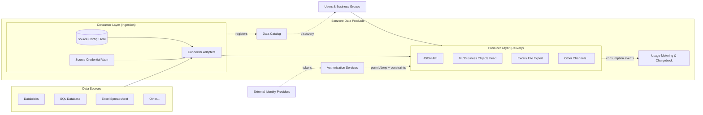
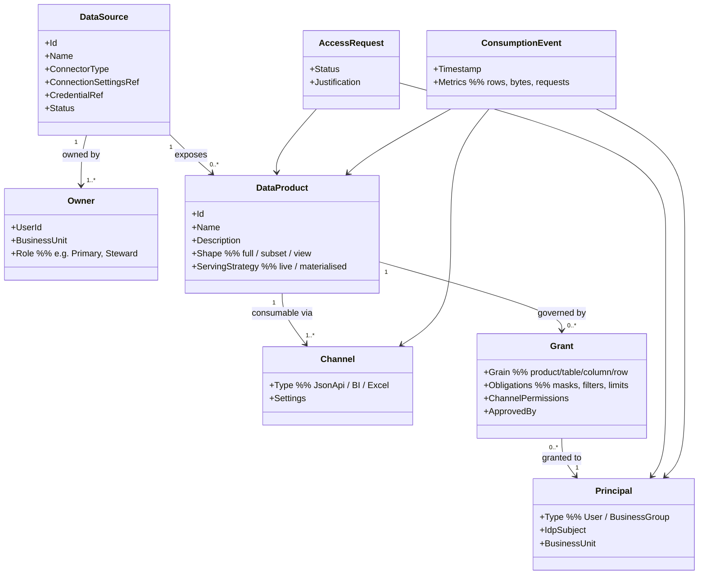

# Benzene Data Products — Top-Level Design

**Status:** Draft for review
**Naming:** The product is **Benzene Data Products** (formerly "Benzene Data
Mesh"). "Data mesh" appears below only when referring to the architectural
paradigm the design draws on; the shorthand for the system itself is **the
platform**.
**Scope:** Top-level (system-of-systems) design. Each component named here gets its own
detailed design document under `docs/design/components/`, produced in separate design
sessions.

---

## 1. Business problem

People across the organisation have data — in Databricks, in SQL databases, in Excel
spreadsheets — and they want to make it available across the business. Today that
means ad-hoc extracts, emailed spreadsheets, and point-to-point integrations with no
ownership, no access control, and no visibility of who is using what.

Benzene Data Products solves this by providing:

- A **governed way to publish data**: a data owner registers a source once, and the
  platform takes care of connectivity, authentication to the source, and
  cataloguing.
- A **flexible way to consume data**: consumers choose *how* they receive data —
  JSON API, a Business Objects report, an Excel spreadsheet — without the owner
  having to build each channel.
- **Fine-grained control**: an authorization layer decides which users and business
  groups can consume which data, because uncontrolled data sharing is the primary
  organisational concern that blocks sharing today.
- **Accountability**: every consumption event is recorded, so business units can be
  virtually billed (charged back) or monitored for the cost of the data they consume,
  and owners can see who uses their data.

## 2. Terminology note (read this first)

In this project the layer names describe the platform's own perspective:

| Term | Meaning in this project | Direction |
| --- | --- | --- |
| **Consumer Layer** | The platform *consumes* data **from** configured data sources (Databricks, SQL, Excel, …) | Sources → Platform |
| **Producer Layer** | The platform *produces* data **to** end users over their chosen channels (JSON API, BI, Excel, …) | Platform → Users |

This is the reverse of how "producer/consumer" is often used in data-mesh literature
(where domains *produce* data products and users *consume* them). All documents in this
repository use the project-local meaning above. Where ambiguity is possible, prefer the
unambiguous synonyms **Ingestion side** (Consumer Layer) and **Delivery side**
(Producer Layer).

## 3. Design principles

1. **Data mesh alignment.** The design follows the four data mesh principles —
   domain-oriented ownership, data as a product, self-serve platform, federated
   computational governance — adapted to a single coherent product rather than a
   loose federation. See `docs/research/data-mesh-principles.md`.
2. **Built on Benzene.** Every service is written as Benzene message handlers
   (hexagonal / ports-and-adapters). Business logic is host-agnostic; hosting behind
   ASP.NET Core, AWS Lambda, Azure Functions, or a self-hosted worker is a deployment
   decision, not a design decision. This applies the same philosophy to our own code
   that the platform applies to data: write once, expose through many adapters.
3. **Configuration over code.** Onboarding a new data source or a new consumption
   channel is configuration (stored in the configuration store), not a code change —
   until a genuinely new *connector type* or *channel type* is needed, which is a
   plug-in.
4. **Trust the IdP, own the authorization.** Authentication is delegated to external
   identity providers (OIDC/OAuth2). The platform never manages passwords.
   Authorization —
   who may consume what, at what grain — is the platform's own responsibility and a
   first-class component.
5. **Everything metered.** No data leaves the Producer Layer without a consumption
   record being written. Metering is infrastructure, not an optional feature.
6. **Every dataset has an owner.** Ownership is part of the domain model, not
   metadata decoration. Actions (approving access, changing constraints) route to
   owners.
7. **Thin control plane, separate data plane.** Catalog, configuration,
   authorization, and metering form a small centralized control plane; data flows
   through a separately scalable data plane (connectors → channels) and never
   transits the control plane. This is the pattern every successful market solution
   shares (see `docs/research/market-landscape.md`, §5).
8. **End-user identity everywhere.** Every consumption — including BI refreshes and
   Excel downloads — carries the end user's identity (on-behalf-of flows), never a
   shared service account. Without this, both fine-grained authorization and
   chargeback break.

## 4. System overview

Request flow for a consumption (simplified):

1. A user authenticates with their organisation's IdP and presents a token to a
   Producer Layer channel (e.g. the JSON API).
2. The channel validates the token (trusted IdP), resolves the user's identity and
   group memberships, and asks **Authorization Services**: *may this principal consume
   this data product through this channel, and under what constraints?*
3. If permitted, the Producer Layer fulfils the request. Data is retrieved through the
   **Consumer Layer** connector for the underlying source (live query or from a
   platform-managed cache/snapshot, per the product's configuration).
4. Constraints from the authorization decision (e.g. column masking, row filters, rate
   or volume limits) are applied before data leaves the platform.
5. A consumption event (who, what, how much, through which channel, when) is emitted
   to **Usage Metering**, which aggregates per user and business unit for chargeback.

## 5. Components

Each component below is a bounded context with its own detailed design to follow.

### 5.1 Consumer Layer (Ingestion) — `components/consumer-layer.md`

Pulls data in from the data sources a customer configures.

- **Connector framework.** A connector is a Benzene adapter implementing a common
  port (e.g. `IDataSourceConnector`: test-connection, discover-schema, read).
  Initial connector set: Databricks, SQL databases (SQL Server/PostgreSQL via
  ADO.NET), Excel spreadsheets (file share / SharePoint / upload). New source types
  are new adapters, not core changes.
- **Source configuration store.** A database holding one record per configured data
  source: connector type, connection settings, refresh/caching policy, and ownership.
  Configuration is versioned and auditable.
- **Authentication to sources.** The platform authenticates *to* sources with credentials
  or service principals held in a credential vault (referenced from configuration,
  never stored inline). Supports secrets, managed identities, and OAuth client
  credentials depending on source type.
- **Ownership domain model.** Every data source has one or more **Owners** —
  named people (and a owning business unit) responsible for the source. Owners
  approve access requests, set constraints, and are displayed in the catalog.
- **Schema discovery & registration.** On registration (and on schedule), the
  connector discovers the source's schema and publishes/updates the corresponding
  entries in the Data Catalog.
- **Low-trust sources.** Excel and other unmanaged sources get schema/contract
  validation at ingestion (they have no governing system of record and are the most
  common cause of silent contract breaks).

### 5.2 Producer Layer (Delivery) — `components/producer-layer.md`

Lets users consume data through the channel of their choice.

- **Channel framework.** A channel is an adapter over a common delivery port.
  Initial channels: **JSON API** (REST, per-product endpoints), **BI / Business
  Objects** (a queryable interface — e.g. ODBC/JDBC-compatible or a universe-feeding
  extract — for reporting tools), **Excel** (downloadable/refreshable spreadsheets).
  **OData** is a strong early candidate because Excel and many BI tools (including
  Business Objects via generic connectors) consume it natively — one channel may
  serve API-style and self-service consumers alike. Later candidates: CSV/Parquet
  export, webhooks/push, streaming.
- **Product shaping.** A consumable *data product* may be the whole source, a subset
  (selected tables/columns), or a defined view/query over it. Shaping is configured,
  not coded.
- **Serving strategy.** Per product: pass-through (live query to the source via the
  Consumer Layer) or materialised (platform-managed snapshot/cache with a refresh
  schedule). This protects fragile sources (an Excel file) from consumer load.
- Every response passes through the **constraint enforcement** step (from
  Authorization) and the **metering** emitter.

### 5.3 Authorization Services — `components/authorization.md`

Decides which users or business groups can consume what data.

- **Model.** Principals are users and business groups (synced/mapped from IdP
  claims). Grants attach to data products at configurable grain: whole product,
  table, column (masking/exclusion), and row-level (filter predicates), plus
  channel-level permissions (e.g. "API yes, Excel export no") and quantitative
  constraints (rate limits, row/volume caps, time windows).
- **Decision point.** A central Policy Decision Point (PDP) service; Producer Layer
  channels are Policy Enforcement Points (PEPs). Decisions return
  *permit/deny + obligations* (masks, filters, limits) that the channel must apply.
- **Access workflow.** The market-standard *publish → discover → subscribe →
  approve → fulfil* loop: users request access via the catalog; requests route to
  the data owner for approval; the platform (not a human) then writes the grant.
  All decisions are auditable.
- **Prefer attribute/tag-based policies.** Per-object grants are supported, but
  classification tags (e.g. `sensitivity=pii`, `domain=finance`) with policies
  attached at a higher level scale better and cannot be overridden by individual
  owners — the ABAC pattern used by Unity Catalog, Lake Formation, and Snowflake.

### 5.4 Authentication (federated) — part of `components/authorization.md`

- The platform runs **no identity store**. It trusts configured external identity
  providers (OIDC/OAuth2 — e.g. Entra ID, Okta). Tokens presented to any channel are
  validated against the trusted issuers; identity and group claims feed the
  authorization model. Service-to-service consumers use client-credential tokens
  from the same IdPs.

### 5.5 Data Catalog — `components/data-catalog.md`

The shop window of the platform.

- Shows **what data is available**, its schema and description, **who owns it**,
  **how it can be consumed** (available channels), its freshness/serving strategy,
  and the **constraints** that apply.
- Entry point for **access requests** (feeding the authorization workflow).
- Owner-facing: owners curate descriptions, set constraints, and see usage of their
  products (from Metering).
- Searchable and browsable by domain/business unit.

### 5.6 Usage Metering & Chargeback — `components/metering-chargeback.md`

- The Producer Layer emits a **consumption event** for every delivery: principal,
  business unit, data product, channel, timestamp, and size metrics (rows/bytes/
  requests).
- Aggregation produces per-business-unit and per-product usage, supporting
  **virtual billing/chargeback** and cost monitoring, plus owner-facing usage
  analytics and anomaly visibility (unusual consumption patterns).
- Rollout is **showback first, chargeback second**: usage dashboards build trust in
  the attribution before any internal billing is enforced (the consistent industry
  lesson — see research).
- Usage data doubles as a discovery signal: the catalog can rank products by
  popularity from the same telemetry.
- Events are the system of record for "who consumed what" — also serving audit and
  compliance queries.

### 5.7 Platform & cross-cutting — `components/platform.md`

- **Benzene hosting.** Shared conventions for composing each service's Benzene
  pipeline (message handlers, middleware for auth, logging, metering) and hosting
  adapters. Deployment topology (Lambda vs containers vs self-hosted) stays open.
- **Configuration store.** Shared persistence approach for source/product/policy
  configuration, versioned and auditable.
- **Observability.** Structured logging, tracing across a consumption request
  (channel → authz → connector), health of sources (connection checks).
- **Eventing.** Consumption events and catalog-change events on an internal message
  bus (Benzene's messaging orientation fits directly).

## 6. Domain model (first cut)

Notes:

- **DataSource vs DataProduct.** A source is the physical thing the Consumer Layer
  connects to; a product is the consumable unit shown in the catalog. The simplest
  configuration is 1:1 (publish the whole source), but the split keeps subsetting and
  multiple shaped views possible without remodelling.
- **Ownership** hangs off the source and is inherited by its products unless
  overridden per product.

## 7. How Benzene shapes the architecture

- Each component's use-cases are **message handlers** behind Benzene ports; HTTP
  (ASP.NET Core), queue/stream, and function-host adapters are added per deployment.
- **Connectors** (Consumer Layer) and **channels** (Producer Layer) are the two big
  adapter families of the system — the data-plane ports. Benzene's ports-and-adapters
  discipline is what makes "configurable sources" and "flexible consumption" cheap to
  extend.
- Cross-cutting concerns — token validation, authorization PEP calls, metering
  emission, logging — are **Benzene middleware**, composed identically into every
  service so no channel can accidentally skip authorization or metering.

## 8. Component design sessions (work split)

Each of these is scoped for an independent design session/agent, in rough priority
order. Dependencies flow downward.

| # | Design doc | Scope | Depends on |
| --- | --- | --- | --- |
| 1 | `components/platform.md` | Benzene composition conventions, config store, eventing, observability | — |
| 2 | `components/consumer-layer.md` | Connector port design, source config schema, credential handling, schema discovery; Databricks/SQL/Excel connectors | 1 |
| 3 | `components/authorization.md` | Authn federation, principal model, grant/obligation model, PDP/PEP contract, access-request workflow | 1 |
| 4 | `components/producer-layer.md` | Channel port design, product shaping, serving strategies; JSON API, BI, Excel channels | 1, 2, 3 |
| 5 | `components/data-catalog.md` | Catalog data model, search, owner curation, access-request UX | 2, 3 |
| 6 | `components/metering-chargeback.md` | Event schema, aggregation, chargeback model, reporting | 1, 4 |

Research inputs for all sessions: `docs/research/data-mesh-principles.md` and
`docs/research/market-landscape.md`.

## 9. Key decisions made (and open questions)

**Decided at this level:**

- Ports-and-adapters throughout, on Benzene; hosting model deferred per deployment.
- Authentication federated to external IdPs; authorization owned by the platform with
  permit/deny + obligations semantics.
- Ownership is mandatory in the domain model.
- All consumption is metered; metering is the audit record.
- Source (physical) and product (consumable) are distinct concepts.

**Open questions for component sessions:**

1. Serving strategy details: caching/materialisation engine, freshness guarantees,
   and how live pass-through respects source rate limits.
2. Whether row-level authorization predicates are expressed in a common expression
   language or per-connector push-down.
3. BI/Business Objects channel mechanics: live semantic layer vs scheduled extract.
4. Multi-tenancy: single corporate deployment first, but should configuration
   isolate multiple organisations?
5. Chargeback pricing model: per-request, per-row, per-GB, or flat per-product
   subscription — likely configurable, needs a decision on the default.
6. Data contracts & versioning: how schema changes in a source propagate to products
   and consumers (breaking-change policy), and whether to adopt an ODCS-style
   (Open Data Contract Standard) machine-readable contract per product from the
   start.
